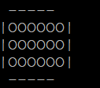
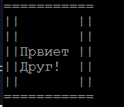
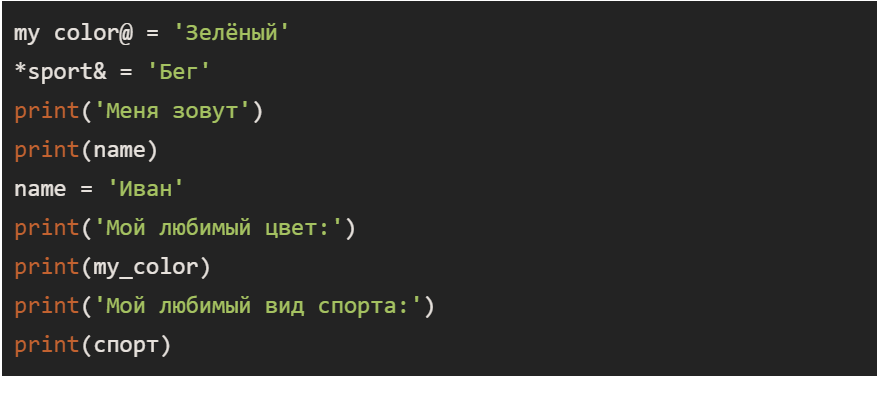

### Python basic from Skillbox

## Contetns
1. [Part 1](#patr-1)
2. [Part 2](#part-2)
3. [Part 3](#part-3)
4. [Part 4](#part-4)
5. [Part 5](#part-5)

## Part 1

- Исправьте програму так, чтобы в результате её выполнения на экра вывелась `Доска`


``` python
print('-'------')
print(' |OOOOOO|')
print("'|OOOOOO|")
print(' |OOOOOO|')
print('-'------")
 ``` 

**== Task 1 ==** 
``` python
print(' ------')
print('|OOOOOO|')
print("|OOOOOO|")
print('|OOOOOO|')
print(" ------")
```


## Part 2
- Напишите программу, которая выводит окно `Привет друг` на экран. Размер окна может быть любым, вместо слово **друг** можите написать своё имя.

**== Task 2 ==**
```python
print("============")
print("||         ||")
print("||         ||")
print("||         ||")
print("||  Привет ||")
print("||  Друг1  ||")
print("||         ||")
print("||         ||")
print("============")
```


## Part 3
- Сделайте переменную, присвойте ей текст <Моя первая переменная> и выведите значение переменной на экран.

**== Task 3 ==**
```python
a = "My first variable"

```


## Part 4
- Исправьте ошибку в коде



**== Task 4==**
```python
my_color = 'Зелёный'
sport = 'Бег'
name = 'Иван'
print('Меня зовут')
print(name)
print('Мой любимый цыет:')
print(my_color)
print('Мой любимый вид спорта: ')
print(sport)
```

## Part 5
- Приветсвие пользователя, сделайте переменную и присвойте ей команду input(). Внутри скобок команды напишите приглашение, например <Введите имя>.
- В следующих двух строках напишет вывод приветсвия и переменной на экран
- Запустите программу, введите в консоль имя и нажмите Enter.
- Убедитесь, что программа работает верно.
```python
name_user = input('Введитие свое имя')
print('Добро пожаловать, ', name_user)
```